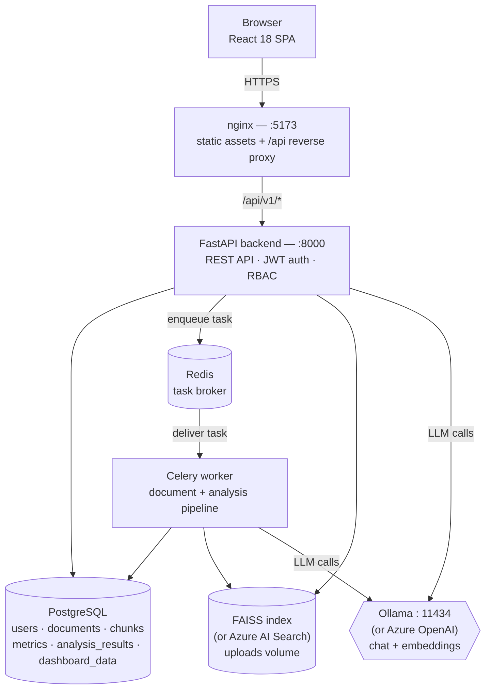
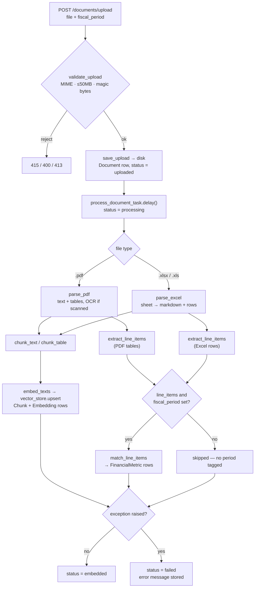
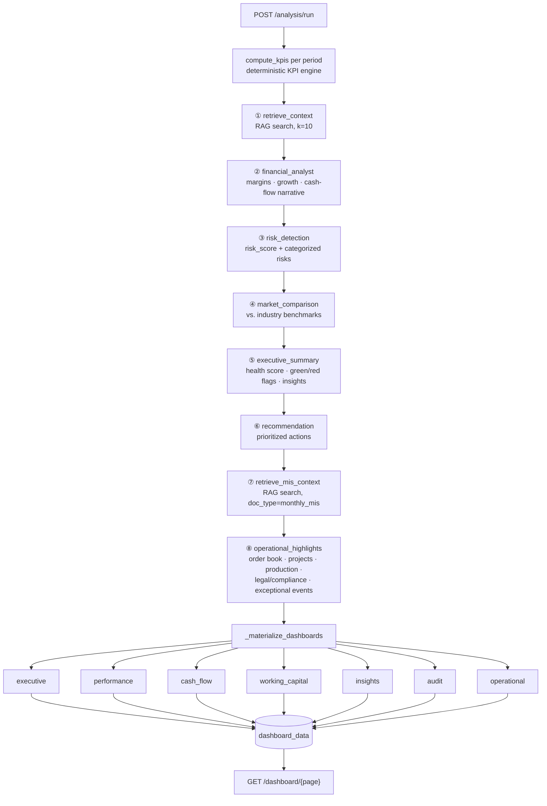

# Architecture & Workflow

## System architecture

Five containers behind one entry point. The browser only ever talks to `nginx:5173`, which serves
the built SPA and reverse-proxies `/api/*` to the backend. Heavy work (parsing, embedding, the agent
pipeline) runs on the Celery worker, never inline on a request.

## Upload → processing workflow

Everything from `POST /documents/upload` to a searchable, KPI-bearing document. This runs entirely
on the worker, off the request thread — the endpoint returns immediately with `status: uploaded`.

> **Why metrics can silently end up empty:** step `J` only persists `FinancialMetric` rows when a
> fiscal period was set at upload time. A document with no period still reaches `embedded`
> successfully — chat/RAG works — but contributes nothing to the KPI engine.

## AI analysis pipeline

Triggered by `POST /analysis/run`. A single LangGraph — 8 nodes, strictly sequential, each one
reading and extending a shared state object. Two nodes are pure retrieval (no LLM call); six are
agents that call the model and return structured JSON.

A seventh agent runs outside this graph: the **Chat agent** (`chat_service.py`) is a single-shot
retrieve → answer step that fires per chat message on `POST /chat`, independent of the
"Run analysis" pipeline above.

## Stack reference

| Layer | Components |
|---|---|
| Frontend | React 18 + TypeScript + Vite, Tailwind, Recharts, React Query, Framer Motion — built static, served by nginx |
| Backend | FastAPI + SQLAlchemy + Pydantic v2, JWT / OAuth2 password flow, RBAC (admin · finance_manager · auditor) |
| Async | Celery worker + Redis broker — document processing and the analysis pipeline never block a request |
| AI / LLM | LangChain + LangGraph orchestration; local Ollama (mistral 7B-instruct + nomic-embed-text) or Azure OpenAI (GPT-4o + text-embedding-3-large), switched by `LLM_PROVIDER` |
| Retrieval | FAISS local vector index (Azure AI Search fallback), filterable by `doc_type` for scoped context |
| Parsing | PyMuPDF + pdfplumber for PDFs, pandas/openpyxl for Excel, Tesseract OCR fallback (Azure Document Intelligence alt) |
| Data | PostgreSQL — documents, chunks, embeddings, financial_metrics, analysis_results, dashboard_data, chat_history |
| Deploy | Docker Compose — db, redis, backend, worker, frontend containers on one bridge network |
